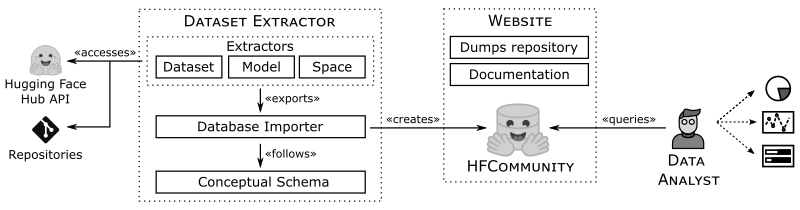

# HFCommunity

HFCommunity is a dataset built via a data collection process relying on the [Hugging Face Hub (HFH)](https://huggingface.co) API and Git. 

HFCommunity dataset is provided as a relational database, and therefore it can be queried via SQL-like languages to enable empirical analysis on ML projects.

The following figure shows the architecture of HFCommunity. 

As can be seen, HFCommunity is composed of two main components: 

* **Dataset Extractor**. The Dataset Extractor includes extractors for the different HFH data elements (i.e., datasets, models, and spaces) and a database importer to store the extracted data. Note that the database importer follows the [conceptual schema for HFCommunity](https://som-research.github.io/HFCommunity/diagram.html), which includes the main entities and relationships to query HFH data (e.g., model, dataset, space, issue or discussion elements).

* **Website**. The Website is a web application that includes the main technical documentation of the tool and the last HFCommunity dataset dumps to be downloaded. A new release of HFCommunity is released every month.

## Dataset Extractor

The Dataset Extractor has been developed in Python and is in charge of importing the HFH data into the HFCommunity dataset. 

To execute the Dataset Extractor please refer to the [docs](https://som-research.github.io/HFCommunity/docs/usage.html).

## Website

The website of HFCommunity is located [here](https://som-research.github.io/HFCommunity/).

The technical documentation of the tool is located [here](https://som-research.github.io/HFCommunity/docs/).

# Contributing

This project is part of a research line of the [SOM Research Lab](https://som-research.uoc.edu/) and [BESSER project](https://github.com/besser-pearl), but we are open to contributions from the community. Any comment is more than welcome!

If you are interested in contributing to this project, please read the [CONTRIBUTING.md](CONTRIBUTING.md) file.

# Code of Conduct

At SOM Research Lab and BESSER we are dedicated to creating and maintaining welcoming, inclusive, safe, and harassment-free development spaces. Anyone participating will be subject to and agrees to sign on to our [Code of Conduct](CODE_OF_CONDUCT.md).

# Governance

The development and community management of this project follows the governance rules described in the [GOVERNANCE.md](GOVERNANCE.md) document.

# License

This work is licensed under a <a rel="license" href="http://creativecommons.org/licenses/by-sa/4.0/">Creative Commons Attribution-ShareAlike 4.0 International License</a>

The [CC BY-SA](https://creativecommons.org/licenses/by-sa/4.0/) license allows users to distribute, remix, adapt, and build upon the material in any medium or format, so long as attribution is given to the creator. The license allows for commercial use. If you remix, adapt, or build upon the material, you must license the modified material under identical terms.

